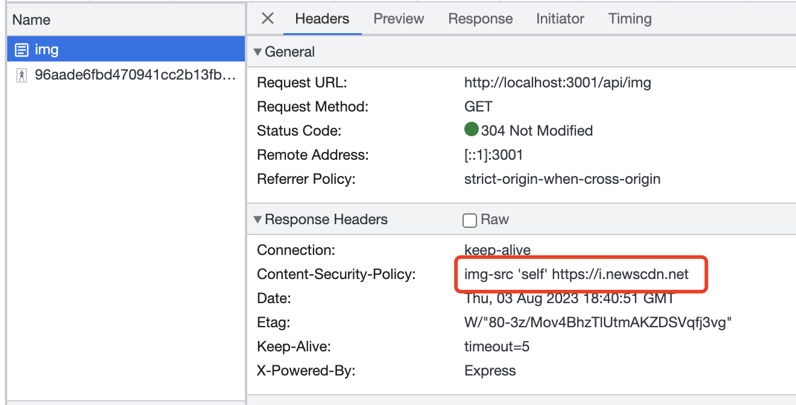

angular安全专辑之一：Use CSP（Content Security Policy） to prevent XSS attacks

### 什么是 CSP（Content Security Policy）
CSP（Content Security Policy）是一种Web安全策略，用于减轻和防止跨站脚本攻击（XSS）等安全漏洞。它通过允许网站管理员定义哪些资源可以加载到网页中，从而限制了恶意脚本的执行。

### CSP 可以起到什么作用
- 禁止加载外域代码，防止复杂的攻击逻辑。
- 禁止外域提交，网站被攻击后，用户的数据不会泄露到外域。
- 禁止内联脚本执行。
- 禁止未授权的脚本执行。


### 如何使用 CSP 解决 XSS 攻击

<!-- CSP通过设置HTTP头部中的Content-Security-Policy字段，或者通过meta标签在HTML文档中定义，来指定策略规则。其中包含了一系列的指令，用于控制允许加载的资源类型和来源。 -->

CSP通过设置HTTP头部中的Content-Security-Policy字段 在白名单策略中，可以使用他来指定浏览器仅渲染或执行来自白名单中的资源。即便是被恶意注入了脚本，因为脚本并不在白名单中，因此不会执行。

以 Node 为例 创建一个 express 服务，并设置 Content-Security-Policy 请求头， 以下是一个简单的示例将所有的脚本限制为只能从同一域加载，但是允许从google.com加载，这样就可以防止XSS攻击，但是允许使用Google Analytics。
```ts
const express = require('express');
const app = express();
const port = 3001;
app.use(express.static('public'));
app.use(function (req, res, next) {
  res.setHeader(
    'Content-security-policy',
    `script-src 'self' https://*.google.com` + `img-src 'self'`
  )
  next();
});
app.listen(port, () => {
  console.log(`Example app listening at http://localhost:${port}`)
})


// https://i.newscdn.net/publisher-c1a3f893382d2b2f8a9aa22a654d9c97/2022/11/96aade6fbd470941cc2b13fb939ba174.png
```
接下来验证一下 CSP 是否生效 在代码中添加限制 img 同源机制,并添加一个接口返回一个 img
通过访问 http://localhost:3001/api/img 会发现页面上的图片无法加载，并在 Console 中输出错误
```ts
res.setHeader(
        'Content-security-policy',
        `img-src 'self'`
    )
```

因为图片的来源不在白名单中，重新将图片域名添加到Content-security-policy 中再次访问 http://localhost:3001/api/img 则可以正常加载图片
```ts
res.setHeader(
        'Content-security-policy',
        `img-src 'self' https://i.newscdn.net`
    )
```


完整代码
```ts
app.get('/api/img', (req, res) => {
    const html = ``
    res.setHeader(
        'Content-security-policy',
        `img-src 'self' https://i.newscdn.net`
    )
    res.send(html)
    res.type('.html')
})
```


### 常见的CSP指令

default-src: 默认策略，适用于其他资源类型没有指定策略时的默认行为。
script-src: 控制加载脚本的来源。
style-src: 控制加载样式表的来源。
img-src: 控制加载图片的来源。
connect-src: 控制加载数据的来源（如AJAX请求）。
font-src: 控制加载字体的来源。
object-src: 控制加载插件（如Flash）的来源。
frame-src: 控制加载框架的来源。
media-src: 控制加载音视频的来源。
